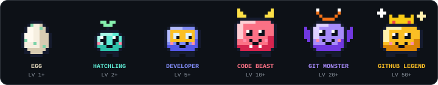

# Gitagotchi

> **Your GitHub activity keeps your pet alive.**

<p align="center">
  
</p>

Gitagotchi is a tiny virtual pet that lives in your GitHub repo. Commits, pull requests and issues feed it. Go quiet and it gets hungry. A scheduled GitHub Action reads your activity, updates the pet, and commits a fresh SVG card you can drop into any README.

No server. No database. No AI API. Just TypeScript, a JSON file and GitHub Actions.

> The image above is a demo placeholder. It is replaced by your own pet after the first workflow run.

## Features

- Pixel-art pet that **evolves through 6 stages** (egg to GitHub Legend) and changes mood with its stats
- **XP, levels, streaks** and 12 achievements, all deterministic and abuse-resistant (daily caps)
- Stats that react to what you do: **health, energy, hunger, happiness**
- Short, fun pet messages ("PR machine detected.", "I miss you.") picked by simple rules
- Runs on **GitHub Actions** and commits only when something changed
- Pure, network-free pet engine with a full unit test suite
- Dark-friendly animated SVG, no external assets or fonts

<p align="center"></p>

## Quick start

Try it offline first:

```bash
git clone https://github.com/sarawagh27/gitagotchi.git
cd gitagotchi
npm install
npm run dev        # writes out/demo.svg using sample activity
```

Open `out/demo.svg` in a browser to meet a demo pet. Requires Node 20+.

## GitHub Actions setup

1. **Use this repo** (fork it, or click "Use this template" if enabled).
2. In the repo go to **Settings → Actions → General → Workflow permissions** and choose **Read and write permissions**.
3. _(Optional)_ Under **Settings → Secrets and variables → Actions → Variables**, add:
   - `PET_NAME`: your pet's name (default `Nova`)
   - `PET_TIMEZONE`: an IANA zone such as `Asia/Kolkata`, used for "days" and the night-owl achievement (default `UTC`)
4. Open the **Actions** tab, pick **Gitagotchi**, and press **Run workflow**. Your pet hatches and `data/pet.json` and `assets/pet.svg` are committed.
5. Show it in your profile or project README:

```markdown

```

After that it updates every 3 hours (edit the cron in `.github/workflows/gitagotchi.yml`).

### Secrets and permissions

| What                                  | Required | Notes                                                                                     |
| ------------------------------------- | -------- | ----------------------------------------------------------------------------------------- |
| Workflow permission `contents: write` | Yes      | Set in the workflow file. Only used to commit `data/pet.json` and `assets/pet.svg`.       |
| `GITHUB_TOKEN`                        | Built in | Provided automatically. Used only for **read** API calls and to avoid low rate limits.    |
| `GITAGOTCHI_TOKEN` secret             | No       | Your own token, if you want to try seeing private activity. Not needed for public events. |

By default only **public** activity counts. GitHub's events API returns private events only to a token authenticated as you; if you try that, give the token the narrowest read access that works and keep it in a secret. Tokens are never logged or written to files.

## Configuration

All configuration is via environment variables (the workflow sets them for you).

| Variable                | Default                  | Description                                                       |
| ----------------------- | ------------------------ | ----------------------------------------------------------------- |
| `GITHUB_USERNAME`       | repo owner (in Actions)  | Whose activity feeds the pet                                      |
| `GITHUB_TOKEN`          | none                     | Optional locally; sent as a Bearer token                          |
| `GITAGOTCHI_TOKEN`      | none                     | Takes priority over `GITHUB_TOKEN`                                |
| `PET_NAME`              | `Nova`                   | 1-16 letters, numbers, spaces, `'` or `-`                         |
| `PET_TIMEZONE`          | `UTC`                    | IANA time zone for day boundaries                                 |
| `GITAGOTCHI_BACKFILL`   | `true`                   | Count the ~90 days of history GitHub exposes when hatching        |
| `GITAGOTCHI_STATE_PATH` | `data/pet.json`          | Where pet state is stored                                         |
| `GITAGOTCHI_SVG_PATH`   | `assets/pet.svg`         | Where the card is written                                         |
| `GITHUB_API_URL`        | `https://api.github.com` | Set automatically in Actions; lets you point at GitHub Enterprise |

To run against your real account locally:

```bash
GITHUB_USERNAME=your-name npm run tick -- --dry-run   # no files written
GITHUB_USERNAME=your-name npm run tick                # updates data/pet.json + assets/pet.svg
```

## How it works

```text
GitHub events API ──▶ normalize ──▶ simulate(state, events, clock) ──▶ data/pet.json
                                                            │
                                                            └──▶ SVG renderer ──▶ assets/pet.svg
```

1. `src/github/` fetches your latest public events (up to 300) and turns them into small normalized activity events.
2. `src/engine/simulation.ts` is a **pure function**: previous state + new events + the current time gives the next state. No network, no randomness.
3. `src/svg/` draws the card from the state (pixel sprites are built from code, no image files).
4. The workflow commits `data/pet.json` and `assets/pet.svg` only if they changed. Events already counted are remembered by id, so reruns never double-award.

## Pet mechanics

### XP (with daily caps so spam can't farm it)

| Activity         | XP                    | Counted up to, per day           |
| ---------------- | --------------------- | -------------------------------- |
| Commit           | 10                    | 10                               |
| Pull request     | 25                    | 4                                |
| Merged PR        | 50                    | 4                                |
| Issue opened     | 5                     | 5                                |
| Issue closed     | 20                    | 3                                |
| New repository   | 75                    | 2                                |
| Daily streak     | 10                    | once per day (streak of 2+ days) |
| Streak milestone | 50 / 200 / 500 / 1000 | at 7 / 30 / 100 / 365 days       |
| Achievement      | 25                    | once each                        |

"Merged PR" is counted when **you** perform the merge, because the events API attributes the action to whoever closed it.

### Levels and evolution

Reaching level _n_ needs `25 × (n-1) × n` total XP. Level 2 takes 50 XP; level 10 takes 2,250.

| Level | Stage         |
| ----- | ------------- |
| 1     | Egg           |
| 2     | Hatchling     |
| 5     | Developer     |
| 10    | Code Beast    |
| 20    | Git Monster   |
| 50    | GitHub Legend |

### Stats (0-100)

- **Hunger** drops when you're active and rises every day. Idle days add extra hunger.
- **Energy** is restored by activity and drains daily.
- **Happiness** rises with activity and streaks, and falls on idle days.
- **Health** is derived: `0.4 × fullness + 0.3 × energy + 0.3 × happiness`.

Your pet never dies. Neglect just makes it weak and sad until you come back. The card shows hunger as **FOOD** (100 means full).

## Achievements

| Achievement     | How to unlock                      |
| --------------- | ---------------------------------- |
| First Commit    | 1 commit                           |
| First PR        | Open a pull request                |
| First Merge     | Merge a pull request               |
| Warming Up      | 3-day streak                       |
| Week Warrior    | 7-day streak                       |
| Unstoppable     | 30-day streak                      |
| Centurion       | 100 commits                        |
| Repo Collector  | Create 10 repositories             |
| Night Owl       | 5 commits between midnight and 5am |
| Weekend Warrior | Active on both Saturday and Sunday |
| PR Machine      | Open 25 pull requests              |
| Bug Hunter      | Close 10 issues                    |

## Limits worth knowing

- The GitHub events API only exposes your **latest 300 events (about 90 days)** and can lag by minutes. The 3-hour schedule keeps the pet well within that window.
- GitHub can pause scheduled workflows after long repository inactivity. If updates ever stop, re-enable the workflow in the Actions tab.
- Commit counts come from push events, so commits made by others but pushed by you count as yours.

## Development

```bash
npm install
npm run dev          # offline demo -> out/demo.svg
npm test             # unit tests (no network needed)
npm run check        # typecheck + lint + format check + tests
npm run gallery      # regenerate README images in docs/
npm run build        # compile to dist/
```

Project layout:

```text
src/
  github/        API client + event normalization
  pet/           XP, levels, evolution, stats, streaks, personality, state schema
  engine/        simulation.ts: the pure state transition
  achievements/  achievement definitions
  svg/           pixel sprites + card renderer
  config.ts      environment parsing and validation
  storage.ts     state file I/O (writes only when content changes)
  index.ts       CLI entry
test/            Vitest suites
scripts/         gallery generator
```

## Roadmap

**V2**: multiple species, richer evolution branches, more achievements, accessories, a smarter personality system, a GitHub Pages dashboard.

**V3**: pet battles, seasonal events, rare pets, cosmetics, a global leaderboard, community challenges.

These are ideas only; the MVP deliberately stays small.

## Contributing

Issues and PRs are welcome. Please keep the spirit of the project: small, readable, no new services. Run `npm run check` before opening a PR and add tests for engine changes.

## License

MIT
